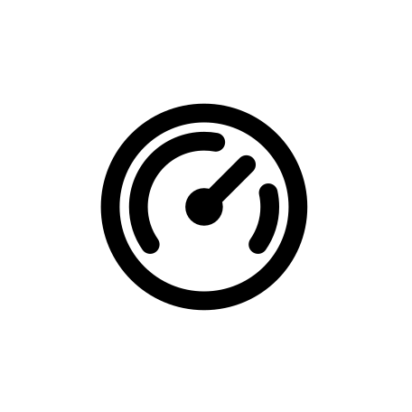
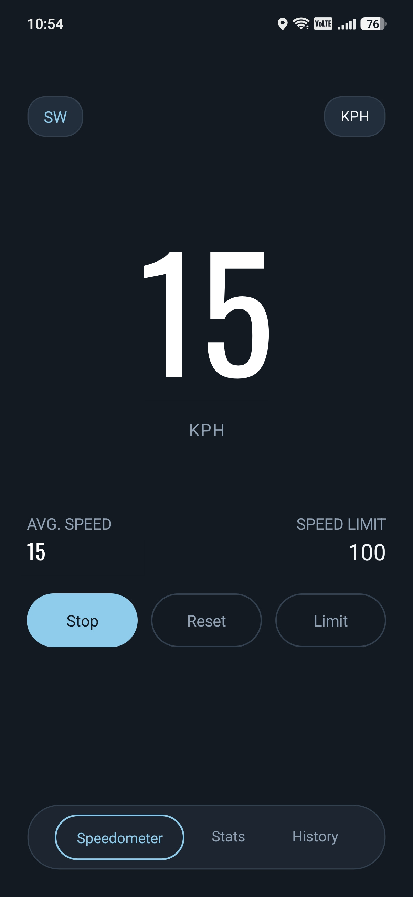
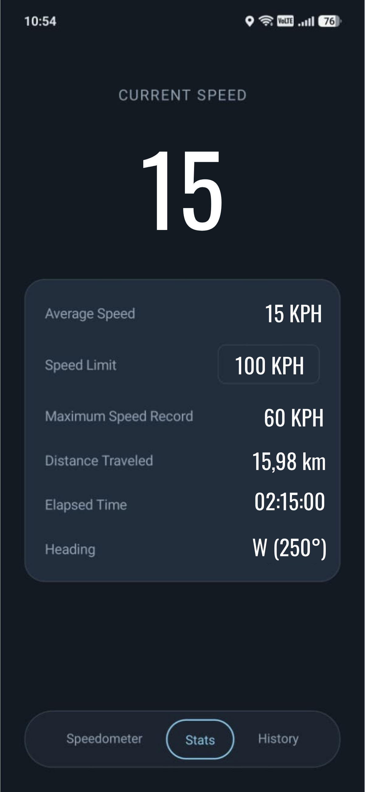
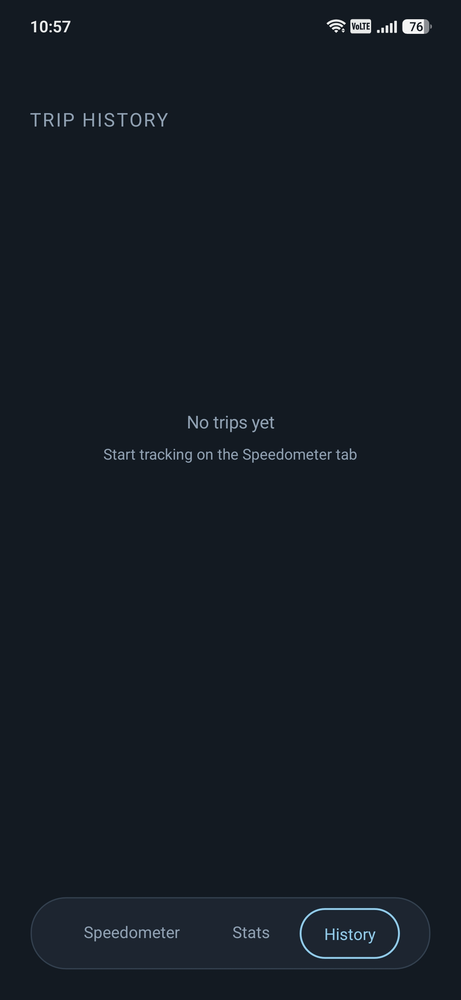

# Swift

<p align="center">
  
</p>

<p align="center">
  <strong>A simple and minimalist GPS speedometer app for Android.</strong>
  <br>
  <br>
  <a href="https://github.com/yahyayev57/Swift/releases/latest">⬇️ Download Swift v1.0.0 Android</a>
</p>

## About

Swift is a minimalist GPS speedometer built with **.NET MAUI** and **C#**. It uses the phone's GPS signals to determine location and calculate speed in real time. The app can display current and average speed, track a trip, calculate distance and elapsed time, record maximum speed, and provide additional trip statistics.

Swift is designed to keep the interface simple, clean, and easy to read while providing the essential information needed during a trip.

## Harvard CS50x Final Project

Swift was created as my **final project for Harvard University's CS50x 2026**.

The goal of Swift is simple: to provide a clean and readable speedometer that can track and summarize a trip using the sensors already available on your phone.

The project demonstrates the programming concepts, problem-solving skills, and development experience I gained throughout CS50x.

## Demo

<p align="center">
  <a href="https://www.youtube.com/watch?v=e0lZAzJbCwg&t=13s">
    
    <br>
    
  </a>
</p>

## Screenshots

<p align="center">
  
  &nbsp;&nbsp;
  
  &nbsp;&nbsp;
  
</p>

## Features

- Real-time GPS speedometer
- Current and average speed
- Maximum recorded speed
- Manually configurable speed limit
- Speed limit warning
- Kilometers per hour and miles per hour
- Phone heading
- Trip distance tracking
- Elapsed trip time
- Detailed trip statistics
- Trip history
- Android emulator testing with GPX data

## Installation

### Requirements

- Android device or emulator
- .NET 10 SDK
- .NET MAUI Android workload
- Android SDK / platform tools

### Build and run

1. Clone the repository:

```bash
git clone https://github.com/yahyayev57/Swift.git
cd Swift
```

2. Install the MAUI Android workload if it is not already installed:

```bash
dotnet workload install maui-android
```

3. Restore dependencies:

```bash
dotnet restore
```

4. Build the project:

```bash
dotnet build
```

5. Run it on a connected Android device or emulator:

```bash
dotnet build -t:Run -f net10.0-android
```

## Testing

Swift includes a custom GPX file in the `Testing` folder for testing GPS functionality during development.
The GPX route can be used with an Android emulator to simulate movement and allow the speedometer and trip-tracking features to be tested without physically traveling the route.

## Built With

<p align="center">
  <strong>C#</strong>&nbsp;&nbsp;•&nbsp;&nbsp;<strong>.NET 10</strong>&nbsp;&nbsp;•&nbsp;&nbsp;<strong>.NET MAUI</strong>&nbsp;&nbsp;•&nbsp;&nbsp;<strong>Android GPS</strong>
</p>

## Made By

<p align="center">
  <strong>Made by Kenan Y.</strong>
</p>